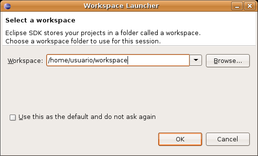
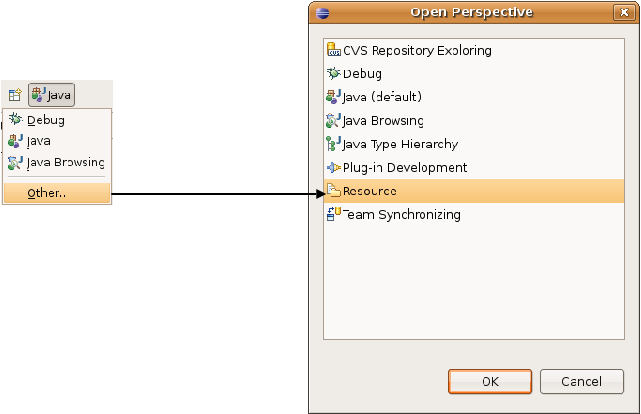
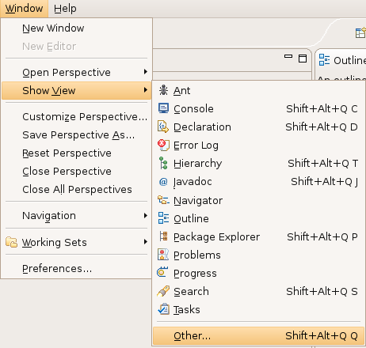
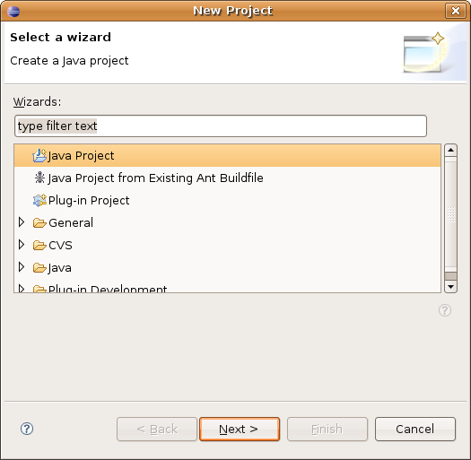
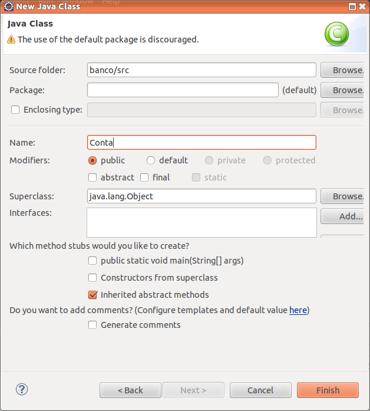
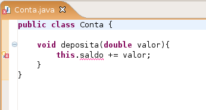
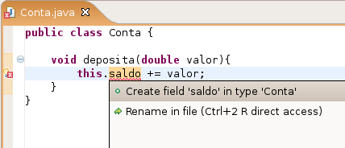
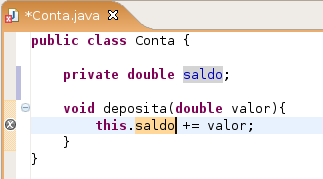
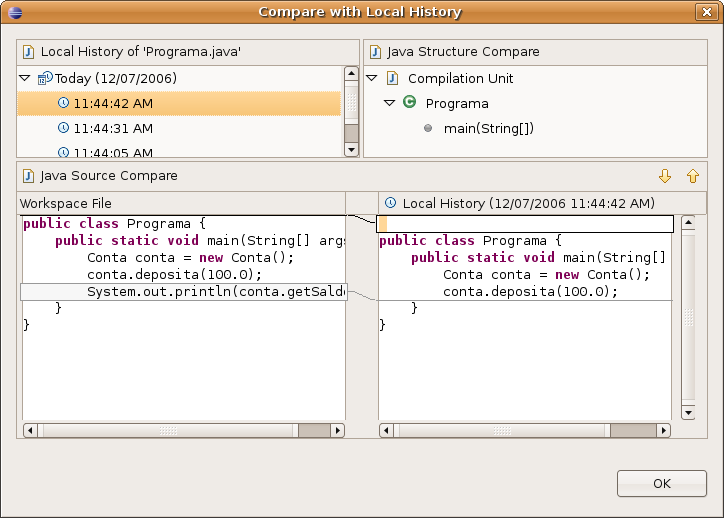

# Eclipse IDE
_"Dá-se importância aos antepassados quando já não temos nenhum."--François Chateaubriand_

Neste capítulo, você será apresentado ao Ambiente de Desenvolvimento Eclipse e suas principais
funcionalidades.


## O Eclipse

O Eclipse (http://www.eclipse.org) é uma IDE (integrated development environment). Diferente de uma
RAD, onde o objetivo é desenvolver o mais rápido possível através do _arrastar-e-soltar do mouse_, onde
montanhas de código são gerados em background, uma IDE te auxilia no desenvolvimento, evitando se
intrometer e fazer muita mágica.

O Eclipse é a IDE líder de mercado. Formada por um consórcio liderado pela IBM, possui seu código
livre.

Veremos aqui os principais recursos do Eclipse. Você perceberá que ele evita ao máximo te atrapalhar
e apenas gera trechos de códigos óbvios, sempre ao seu comando. Existem também centenas de plugins
gratuitos para gerar diagramas UML, suporte a servidores de aplicação, visualizadores de banco de
dados e muitos outros.

Baixe o Eclipse do site oficial http://www.eclipse.org. Apesar de ser escrito em Java, a biblioteca
gráfica usada no Eclipse, chamada SWT, usa componentes nativos do sistema operacional. Por isso você
deve baixar a versão correspondente ao seu sistema operacional.

Descompacte o arquivo e pronto, basta rodar o executável.

> **Outras IDEs**
>
> Uma outra IDE open source famosa é o Netbeans, da Oracle. (http://www.netbeans.org).
>
> Além dessas, Oracle, Borland e a própria IBM possuem IDEs comerciais e algumas versões mais
> restritas de uso livre.
>
> A empresa JetBrains desenvolve o IntelliJ IDEA, uma IDE paga que tem ganho muitos adeptos.


## Apresentando o Eclipse

Clique no ícone do Eclipse no seu Desktop.

A primeira pergunta que ele te faz é que workspace você vai usar. Workspace define o diretório em que
as suas configurações pessoais e seus projetos serão gravados.



Você pode deixar o diretório pré-definido.

Logo em seguida, uma tela de Welcome será aberta, onde você tem diversos links para tutoriais e ajuda.
Clique em Workbench.


## Views e Perspective

Feche a tela de Welcome e você verá a tela abaixo. Nesta tela, destacamos as Views (em linha contínua)
e as Perspectives (em linha pontilhada) do Eclipse.


Mude para a perspectiva Resource, clicando no ícone ao lado da perspectiva Java, selecionando Other e
depois Resource. Neste momento, trabalharemos com esta perspectiva, antes da de Java, pois ela possui
um conjunto de Views mais simples.



A View Navigator mostra a estrutura de diretório assim como está no sistema de arquivos. A View
Outline mostra um resumo das classes, interfaces e enumerações declaradas no arquivo java atualmente
editado (serve também para outros tipos de arquivos).

No menu **Window -> Show View -> Other**, você pode ver as dezenas de Views que já vem embutidas no
Eclipse. Acostume-se a sempre procurar novas Views, elas podem te ajudar em diversas tarefas.



## Criando um projeto novo

Vá em **File -> New -> Project**. Seleciona Java Project e clique em Next.





Crie um projeto chamado `fj11-contas`.

Você pode chegar nessa mesma tela clicando com o botão da direta no espaço da View Navigator e
seguindo o mesmo menu. Nesta tela, configure seu projeto como na tela abaixo:


Isto é, marque "create separate source and output folders", desta maneira seus arquivos java e
arquivos class estarão em diretórios diferentes, para você trabalhar de uma maneira mais organizada.

Clique em Finish. O Eclipse pedirá para trocar a perspectiva para Java; escolha "**No**" para
permanecer em Resource. Na View _Navigator_, você verá o novo projeto e suas pastas e arquivos:


Vamos iniciar nosso projeto criando a classe Conta. Para isso, vá em File -> New -> Other -> Class.
Clique em Next e crie a classe seguindo a tela abaixo:



Clique em Finish. O Eclipse possui diversos wizards, mas usaremos o mínimo deles. O interessante é
usar o _code assist_ e _quick fixes_ que a ferramenta possui e veremos em seguida. Não se atente
às milhares de opções de cada wizard, a parte mais interessante do Eclipse não é essa.

Escreva o método `deposita` como abaixo e note que o Eclipse reclama de erro em `this.saldo` pois
este atributo não existe.



Vamos usar o recurso do Eclipse de **quick fix**. Coloque o cursor em cima do erro e aperte Ctrl + 1.



O Eclipse sugerirá possíveis formas de consertar o erro; uma delas é, justamente, criar o campo
`saldo` na classe `Conta`, que é nosso objetivo. Clique nesta opção.



Este recurso de quick fixes, acessível pelo Ctrl+1, é uma das grandes facilidades do Eclipse e é
extremamente poderoso. Através dele é possível corrigir boa parte dos erros na hora de programar e,
como fizemos, economizar a digitação de certos códigos repetitivos. No nosso exemplo, não precisamos
criar o campo antes; o Eclipse faz isso para nós. Ele até acerta a tipagem, já que estamos somando
ele a um double. O `private` é colocado por motivos que já estudamos.

Vá ao menu File -> Save para gravar. Control + S tem o mesmo efeito.


## Criando o main

Crie uma nova classe chamada `Principal`. Vamos colocar um método `main` para  testar nossa Conta.
Em vez de digitar todo o método `main`, vamos usar o **code assist** do Eclipse. Escreva só `main`
e aperte Ctrl + Espaço logo em seguida.


O Eclipse sugerirá a criação do método `main` completo; selecione esta opção. O control + espaço é
chamado de **code assist**. Assim como os quick fixes são de extrema importância. Experimente usar o
code assist em diversos lugares.

Dentro do método `main`, comece a digitar o seguinte código:

``` java
Conta conta = new Conta();
conta.deposita(100.0);
```

Observe que, na hora de invocar o método sobre o objeto conta, o Eclipse sugere os métodos possíveis.
Este recurso é bastante útil, principalmente quando estivermos programando com classes que não são as
nossas, como da API do Java. O Eclipse aciona este recurso quando você digita o ponto logo após um
objeto (e você pode usar o Ctrl+Espaço para acioná-lo).

Vamos imprimir o saldo com `System.out.println`. Mas, mesmo nesse código, o Eclipse nos
ajuda. Escreva `syso` e aperte Ctrl+Espaço que o Eclipse escreverá System.out.println() para você.

Para imprimir, chame o `conta.getSaldo()`:

``` java
System.out.println(conta.getSaldo());
```

Note que o Eclipse acusará erro em `getSaldo()` porque este método não existe na classe `Conta`.
Vamos usar Ctrl+1 em cima do erro para corrigir o problema:


O Eclipse sugere criar um método `getSaldo()` na classe `Conta`. Selecione esta opção e o método
será inserido automaticamente.

``` java
	public Object getSaldo() {
		// TODO Auto-generated method stub
		return null;
	}
```

Ele gera um método não exatamente como queríamos, pois nem sempre há como o Eclipse ter de antemão informações
suficientes para que ele acerte a assinatura do seu método. Modifique o método `getSaldo` como segue:

``` java
	public double getSaldo() {
		return this.saldo;
	}
```

Esses pequenos recursos do Eclipse são de extrema utilidade. Dessa maneira, você pode programar sem
se preocupar com métodos que ainda não existem, já que a qualquer momento ele pode gerar o
esqueleto (a parte da assinatura do método).

## Executando o main

Vamos rodar o método `main` dessa nossa classe. No Eclipse, clique com o botão direito no arquivo
`Principal.java` e vá em Run as... Java Application.


O Eclipse abrirá uma View chamada Console onde será apresentada a saída do seu programa:


Quando você precisar rodar de novo, basta clicar no ícone verde de play na toolbar, que roda o
programa anterior. Ao lado desse ícone tem uma setinha onde são listados os 10 últimos executados.

## Pequenos truques

O Eclipse possui muitos atalhos úteis para o programador. Sem dúvida os 3 mais importantes de conhecer
e de praticar são:


* **Ctrl + 1** Aciona o quick fixes com sugestões para correção de erros.

* **Ctrl + Espaço** Completa códigos

* **Ctrl + 3** Aciona modo de descoberta de menu. Experimente digitar **Ctrl+3** e depois digitar **ggas** e **enter**.
Ou então de **Ctrl + 3** e digite _new class_.


Você pode ler muito mais detalhes sobre esses atalhos no blog da Caelum:
http://blog.caelum.com.br/as-tres-principais-teclas-de-atalho-do-eclipse/

Existem dezenas de outros. Dentre os mais utilizados pelos desenvolvedores da Caelum, escolhemos os seguintes
para comentar:


* **Ctrl + F11** roda a última classe que você rodou. É o mesmo que clicar no ícone verde que parece um botão de play
na barra de ferramentas.

* **Ctrl + PgUp** e **Ctrl + PgDown** Navega nas abas abertas. Útil quando estiver editando vários arquivos ao mesmo tempo.

* **Ctrl + Shift + F** Formata o código segundo as convenções do Java

* **Ctrl + M** Expande a View atual para a tela toda (mesmo efeito de dar dois cliques no título da View)

* **Ctrl + Shift + L** Exibe todos os atalhos possíveis.

* **Ctrl + O** Exibe um outline para rápida navegação

* **Alt + Shift + X e depois J** Roda o `main` da classe atual. Péssimo para pressionar! Mais fácil você digitar
**Control+3** e depois digitar _Run_!. Abuse desde já do **Control+3**


Veremos mais no decorrer do curso, em especial quando virmos pacotes.

## Exercícios: Eclipse
1. Crie o projeto `fj11-contas`. Você pode usar o atalho _control + n_ ou então ir
	no menu _File_ -> _New_ -> _Project..._ -> _Java Project_.
1. Dentro do projeto `fj11-contas`, crie a classe `Conta`.
	Uma conta deve ter as seguintes informações: `saldo` (double), `titular`
	(String), `numero` (int) e `agencia` (String).
	Na classe `Conta`, crie os métodos `deposita` e
	`saca` como nos capítulos anteriores.
	Crie também uma classe `TesteDaConta` com o `main` e instancie uma conta.
	Desta vez, tente abusar do _control + espaço_ e _control + 1_.

	Por exemplo:

	`publ<ctrl espaco> v<ctrl espaco> deposita(do<ctrl espaço> valor){`

	Repare que até mesmo nomes de variáveis, ele cria para você! Acompanhe as dicas
	do instrutor.

	Muitas vezes, ao criarmos um objeto, nem mesmo declaramos a variável:

	``` java
	new Conta();
	```

	Vá nessa linha e dê _control + 1_. Ele vai sugerir e declarará a variável
	pra você.
1. Imagine que queremos criar um setter do titular para a classe `Conta`. Dentro
	da classe `Conta`, digite:

	`setTit<ctrl + espaco>`

	Outra forma para criar os getters e os setters para os atributos da classe `Conta`,
	é utilizar o atalho _control + 3_ e na caixa de seleção digite _ggas_, iniciais
	de _Generate Getters and Setters_!

	OBS: Não crie um setter para o atributo `saldo`!
1. Vá para a classe que tem o `main` e segure o CONTROL apertado enquanto você
	passa o mouse sobre o seu código. Repare que tudo virou hyperlink. Clique em
	um método que você está invocando na classe `Conta`.

	Você pode conseguir o mesmo efeito, de abrir o arquivo no qual o método foi
	declarado, de uma maneira ainda mais prática: sem usar o mouse, quando o cursor
	estiver sobre o que você quer analisar, simplesmente clique `F3`.
1. Dê um clique da direita em um arquivo no navigator. Escolha
	**Compare With -> Local History**. O que é esta tela?

	

	
1. Use o _Control + Shift + F_ para formatar o seu código. Dessa maneira, ele vai
	arrumar a bagunça de espaçamento e enters do seu código.

	
1. (opcional) O que são os arquivos .project e .classpath? Leia o conteúdo deles.

	
1. (opcional) Clique da direita no projeto, propriedades. É uma das telas mais
	importantes do Eclipse, onde você pode configurar diversas informações para
	o seu projeto, como compilador, versões, formatador e outros.

	

	


## Discussão em aula: Refactoring

Existe um menu no Eclipse chamado _Refactor_. Ele tem opções bastante interessantes
para auxiliar na alteração de código para melhorar organização ou clareza. Por
exemplo, uma de suas funcionalidades é tornar possível mudar o nome de uma variável,
método ou mesmo classe de forma que uma alteração (em um lugar só do sistema)
atualize todas as outras vezes que usavam o nome antigo.

Usar bons nomes no seu código é um excelente começo para mantê-lo legível e fácil de dar manutenção! Mas o assunto "Refatoração" não para por aí: quebrar métodos grandes em menores, dividir classes grandes em algumas pequenas e mais concisas, melhorar o
encapsulamento... todas essas são formas de refatoração. E esse menu do Eclipse nos
ajuda a fazer várias delas.


