# Ferramentas: jar e javadoc
_"Perder tempo em aprender coisas que não interessam, priva-nos de descobrir coisas
interessantes" -- Carlos Drummond de Andrade_

Ao término desse capítulo, você será capaz de:

- criar o JAR do seu aplicativo;
- colocar um JAR no build path do seu projeto;
- ler um javadoc;
- criar o javadoc do seu aplicativo.


## Arquivos, bibliotecas e versões
Assim que um programa fica pronto, é meio complicado enviar dezenas ou centenas de classes para cada
cliente que quer utilizá-lo.

O jeito mais simples de trabalhar com um conjunto de classes é compactá-los em um arquivo só. O
formato de compactação padrão é o **`ZIP`** com a extensão do arquivo compactado **`JAR`**.

> **O arquivo .jar**
>
> O arquivo **jar** ou **J**ava **AR**chive, possui um conjunto de classes (e arquivos de
> configurações) compactados, no estilo de um arquivo **`zip`**. O arquivo **`jar`** pode ser
> criado com qualquer compactador **`zip`** disponível no mercado, inclusive o programa **`jar`**
> que vem junto com o JDK.


Para criar um arquivo jar do nosso programa de banco, basta ir ao diretório onde estão contidas as
classes e usar o comando a seguir para criar o arquivo **`banco.jar`** com todas as classes dos
pacotes `br.com.caelum.util` e `br.com.caelum.banco`:

```
jar -cvf banco.jar br/com/caelum/util/*.class br/com/caelum/banco/*.class
```

Para usar esse arquivo `banco.jar` para rodar o `TesteDoBanco` basta rodar o `java` com o
arquivo `jar` como argumento:

```
java -classpath banco.jar br.com.caelum.contas.main.TesteDoBanco
```

Para adicionar mais arquivos **`.jar`**, que podem ser bibliotecas, ao programa basta rodar o java
da seguinte maneira:

```
java -classpath biblioteca1.jar;biblioteca2.jar NomeDaClasse
```

Vale lembrar que o ponto e vírgula utilizado só é válido em ambiente Windows. Em Linux, Mac e outros Unix,
é o dois pontos (varia de acordo com o sistema operacional).

Há também um arquivo de manifesto que contém informações do seu jar como, por exemplo, qual classe
ele vai rodar quando o jar for chamado. Mas não se preocupe pois, com o Eclipse, esse arquivo é
gerado automaticamente.

> **Bibliotecas**
>
> Diversas bibliotecas podem ser controladas de acordo com a versão por estarem sempre compactadas em
> um arquivo `.jar`. Basta verificar o nome da biblioteca (por exemplo `log4j-1.2.13.jar`) para
> descobrir a versão dela.
>
> Então é possível rodar dois programas ao mesmo tempo, cada um utilizando uma versão da biblioteca
> através do parâmetro **`-classpath`** do java.


> **Criando um .jar automaticamente**
>
>
> Existem diversas ferramentas que servem para automatizar o processo de deploy, que consiste em
> compilar, gerar documentação, bibliotecas etc. As duas mais famosas são o **ANT** e o **MAVEN**,
> ambos são projetos do grupo Apache.
>
> O Eclipse pode gerar facilmente um jar, porém, se o seu build é complexo e precisa preparar e copiar
> uma série de recursos, as ferramentas indicadas acima possuem sofisticadas maneiras de rodar um
> script batch.


## Gerando o JAR pelo Eclipse

Neste exemplo, vamos gerar o arquivo JAR do nosso projeto a partir do Eclipse:


* Clique com o botão direito em cima do nome do seu projeto e selecione a opção Export.
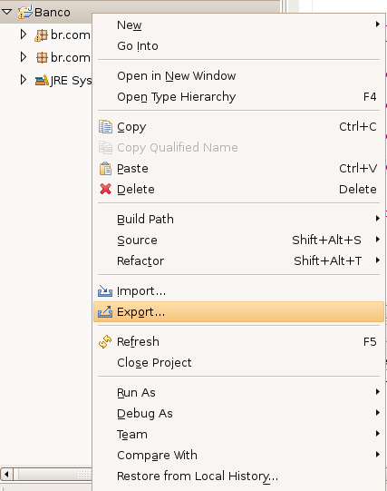

* Na tela Export (como mostra a figura abaixo), selecione a opção "JAR file" e aperte o botão "Next".
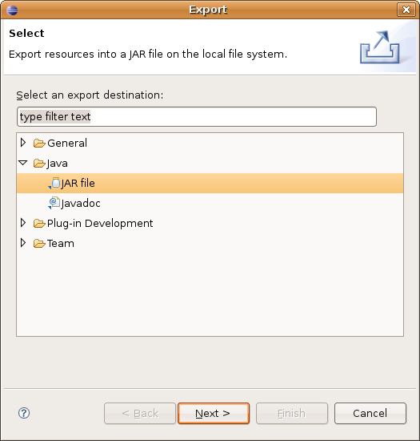

* Na opção "JAR file:", selecione o local que você deseja salvar o arquivo JAR. E aperte "Next".
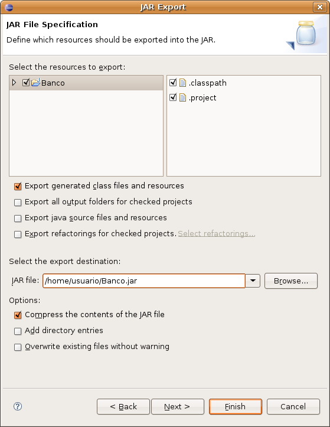

* Na próxima tela, simplesmente clique em next, pois não há nenhuma configuração a ser feita.

* Na tela abaixo, na opção "select the class of the application entry point", você deve escolher
qual classe será a classe que vai rodar automaticamente quando você executar o JAR.
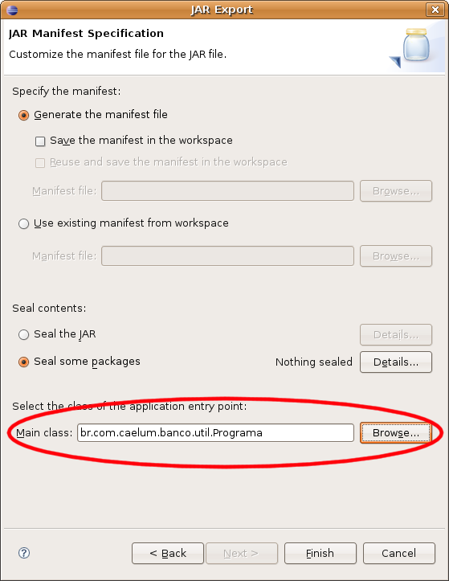

* Entre na linha de comando: `java -jar banco.jar`


É comum dar um nome mais significativo aos JARs, incluindo nome da empresa,
do projeto e versão, como `caelum-banco-1.0.jar`.

## Javadoc

Como vamos saber o que cada classe tem no Java? Quais são seus métodos, o que eles fazem?

E, a partir da Internet, você pode acessar através do link:
http://download.java.net/jdk8/docs/api/index.html


No site da Oracle, você pode (e deve) baixar a documentação das bibliotecas do Java, frequentemente
referida como "**javadoc**" ou API (sendo na verdade a documentação da API).


Nesta documentação, no quadro superior esquerdo, você encontra os pacotes e, no inferior esquerdo,
está a listagem das classes e interfaces do respectivo pacote (ou de todos, caso nenhum tenha sido
especificado). Clicando-se em uma classe ou interface, o quadro da direita passa a detalhar todos
atributos e métodos.

Repare que métodos e atributos privados não estão aí. O importante é documentar o que sua classe faz,
e não como ela faz: detalhes de implementação, como atributos e métodos privados, não interessam ao
desenvolvedor que usará a sua biblioteca (ou, ao menos, não deveriam interessar).

Você também consegue gerar esse javadoc a partir da linha de comando, com o comando: `javadoc`.

## Gerando o Javadoc
Para gerar o Javadoc a partir do Eclipse é muito simples, siga os passos abaixo:


* Na barra de menu, selecione o menu Project, depois a opção "Generate Javadoc...". (apenas
disponível se estiver na perspectiva Java, mas você pode acessar o mesmo wizard pelo export do
projeto).
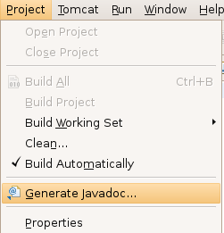

* Em seguida, aparecerão as opções para gerar a documentação do seu sistema, selecione todas as
classes do seu sistema e deixe as outras opções como estão. Não esqueça de marcar o caminho da opção
"Destination", pois é lá que estará sua documentação.
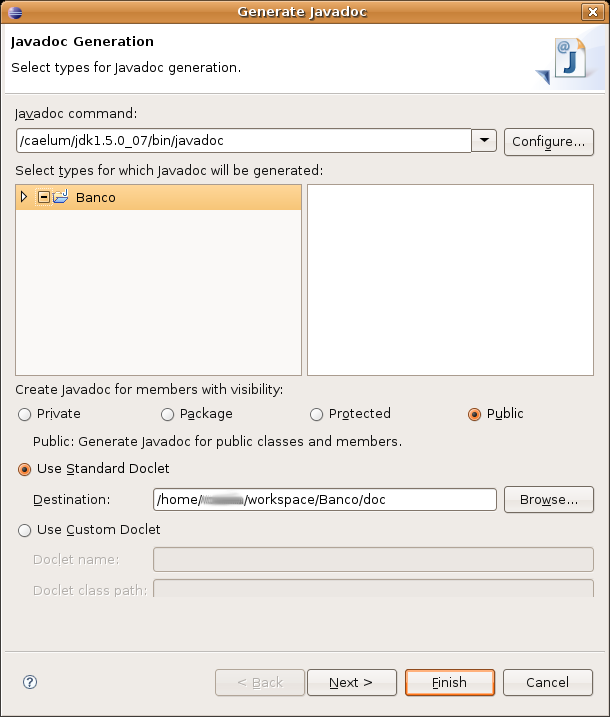

* Abra a documentação através do caminho que você marcou e abra o arquivo index.html, que vai chamar
uma página semelhante a essa da figura abaixo.
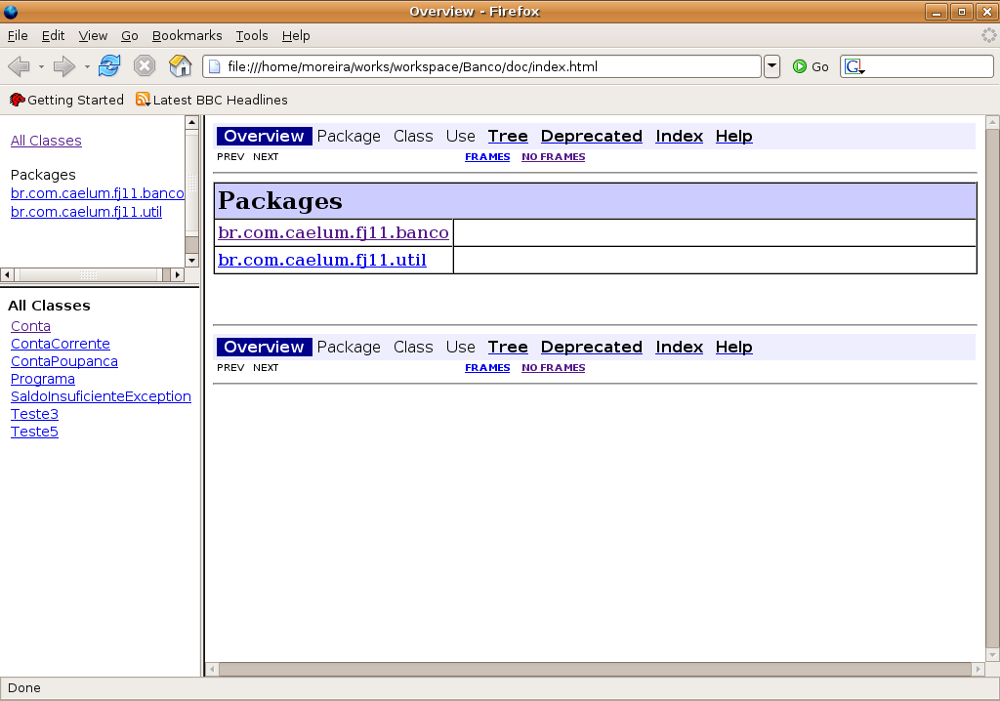

Para colocarmos comentários na documentação, devemos adicionar ao código, sob forma de comentário,
abrindo o texto com `/**` e fechando com `*/` e, nas outras linhas, apenas colocando `*`.
Também podemos definir outras informações neste texto, como: autor, versão, parâmetros, retorno, etc.
Adicione alguns comentários ao seu projeto como abaixo:

``` java
	/**
	 * Classe responsável por moldar as Contas do Banco
	 *
	 * @author Manoel Santos da Silva
	 */
	
	public class Conta{
		...
	}
```

Ou adicione alguns comentários em algum método seu:
``` java
	/**
	 * Metodo que incrementa o saldo.
	 * @param valor
	 */
	
	public void deposita(double valor) {
		...
	}
```

Veja como ficou:


## Exercícios: Jar e Javadoc
1. Gere um jar do seu sistema com o arquivo de manifesto. Execute-o com `java -jar`:

	```java -jar caelum-banco-1.0.jar```

	Se o Windows ou o Linux foi configurado para trabalhar com a extensão _.jar_, basta você dar
	um duplo clique no arquivo, que ele será "executado": o arquivo `Manifest` será lido para que
	ele descubra qual é a classe com `main` que o Java deve processar.
1. Gere o Javadoc do seu sistema. Para isso, vá ao menu _Project_, depois à opção _Generate
	Javadoc_, se estiver na perspectiva Java. Se não, dê um clique com o botão direito no seu
	projeto, escolha _Export_ e depois _javadoc_ e siga o procedimento descrito na última seção
	deste capítulo.

	Independente da perspectiva que você usa no Eclipse, você também pode usar o **ctrl + 3** e
	começar a escrever `JavaDoc`, até que a opção de exportar o JavaDoc apareça.


> **Interface versus implementação novamente!**
>
> Repare que a documentação gerada não mostra o conteúdo dos métodos,
> nem atributos e métodos privados! Isso faz parte da implementação, e o que
> importa para quem usa uma biblioteca é a interface: o que ela faz.


## Importando um jar externo

Já sabemos como documentar nosso projeto e gerar um jar para distribuí-lo mas ela ainda não tem uma interface gráfica do usuário. Se quisermos rodar o nosso sistema temos que executá-lo pelo terminal com os valores _hard-coded_. Seria mais interessante que tivéssemos uma interface mais amigável para que o usuário pudesse interagir com o nosso sistema. Ao mesmo tempo, não queremos nos preocupar nesse momento em criar todas as classes para representar essa interface gráfica, queremos apenas utilizar algo já pronto.

Para isso, vamos importar uma biblioteca externa. O próprio Eclipse já nos dá suporte para a importação de jars. Para fazer isso, basta ir no menu Project -> Properties, selecionar a opção Java Build Path, depois selecionar a aba Libraries e, finalmente, clicar no botão Add External Jars... . Agora é só selecionar o jar a ser importado e clicar em Open. Clique em Ok novamente para fechar a janela de importação e pronto! Nossa biblioteca já está pronta para ser utilizada.

## Exercícios: Importando um jar
1. Vamos importar um jar que contém a interface gráfica do usuário para o nosso sistema de contas.

	* Vá no menu **Project -> Properties**
	* Selecione a opção **Java Build Path**
	* Selecione a aba **Libraries**

	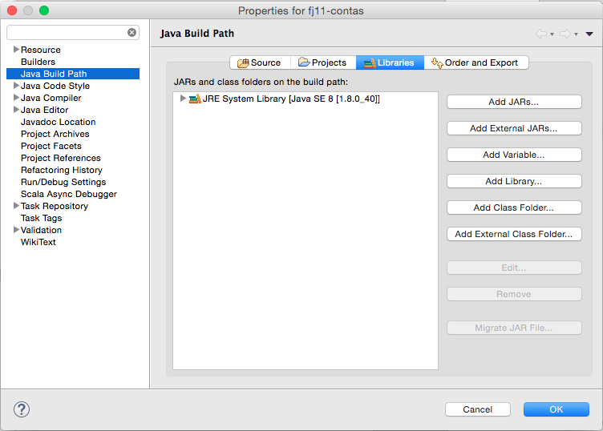

	* Clique no botão **Add External Jars...**
	* Selecione o arquivo **fj11-lib-contas.jar** localizado na pasta dos arquivos dos cursos/11

	

	* Clique no botão **Ok** para fechar a janela de importação
1. Para verificarmos que a importação deu certo, vamos chamar uma classe da biblioteca importada para exibir uma janela de boas-vindas.

	Crie uma classe `TestaJar` no pacote `br.com.caelum.contas.main`.

	Crie também o método `main`.
1. Dentro do método criado, vamos invocar o método `main` da classe `OlaMundo` que existe no jar importado. Seu código deve ficar dessa maneira:

	``` java
 package br.com.caelum.contas.main;

 import br.com.caelum.javafx.api.main.OlaMundo;

 public class TestaJar {

    public static void main(String[] args) {
        OlaMundo.main(args);
    }
 }
	```

	Não esqueça de importar a classe `OlaMundo` do pacote `br.com.caelum.javafx.api.main`. Use o atalho **ctrl + shift + O**.
1. Execute a sua aplicação e veja se apareceu uma janela de boas-vindas como a seguir:

	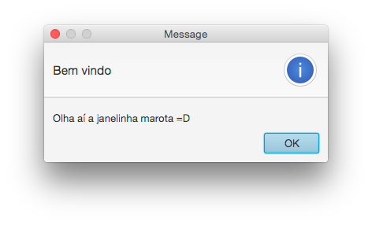


## Manipulando a conta pela interface gráfica

Agora que já importamos o Jar que contém a interface gráfica, vamos dar uma olhada na
primeira tela do nosso sistema:


Nesta tela, podemos perceber que temos botões para as ações de criação de conta, saque
e depósito, que devem utilizar a implementação existente em nossa classe `Conta`.

Se quisermos visualizar a tela, podemos criar um `main` que chamará a classe
`TelaDeContas` responsável pela sua exibição:

``` java
package br.com.caelum.contas.main;

import br.com.caelum.javafx.api.main.TelaDeContas;

public class TestaContas {

    public static void main(String[] args) {
        TelaDeContas.main(args);
    }
}
```

Ao executarmos a aplicação ocorrerá um erro:

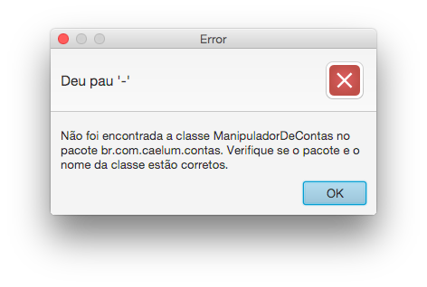

Mas por que este erro ocorreu? Acontece que a tela precisa conhecer alguém que saiba
executar as ações de saque e depósito na conta, que consiga buscar os dados da tela
para popular a conta. Como não temos ninguém que saiba fazer isto ainda, ocorreu o
erro.

Vamos então criar a classe `ManipuladorDeContas` que será responsável por fazer esta "ponte" entre a
tela e a classe de `Conta`:

``` java
package br.com.caelum.contas;

public class ManipuladorDeContas {

}
```

Agora, ao executarmos a aplicação, veremos que a tela aparece com sucesso:


E se tentarmos clicar no botão de criação de conta? Também ocorre um erro!


Desta vez o erro indica que falta o método `criaConta` dentro da classe
`ManipuladorDeContas`. Vamos então criá-lo:

``` java
public class ManipuladorDeContas {

    public void criaConta(){
        Conta conta = new Conta();
        conta.setAgencia("1234");
        conta.setNumero(56789);
        conta.setTitular("Batman");
    }
}
```

Para conseguirmos obter as informações da tela, todos os
métodos que criaremos precisam receber um parâmetro do tipo `Evento` que conterá as
informações digitadas. Mesmo que não utilizemos este parâmetro, precisamos recebê-lo.

``` java
import br.com.caelum.javafx.api.util.Evento;

public class ManipuladorDeContas {

    public void criaConta(Evento evento){
        Conta conta = new Conta();
        conta.setAgencia("1234");
        conta.setNumero(56789);
        conta.setTitular("Batman");
    }
}
```

Se tentarmos executar a aplicação e clicar no botão **cria conta**, vemos que agora não
ocorre mais nenhum erro mas ao mesmo tempo os dados da conta não são populados na tela.
Isto acontece pois a variável `conta` é apenas local, ou seja, ela só existe dentro
do método `criaConta`. Além disso se quiséssemos depositar um valor na conta, em
qual conta depositaríamos? Ela não é visível para nenhum outro método!

Precisamos que esta variável seja um atributo do `ManipuladorDeContas`. Vamos
alterar:

``` java
import br.com.caelum.javafx.api.util.Evento;

public class ManipuladorDeContas {

    private Conta conta;

    public void criaConta(Evento evento){
        this.conta = new Conta();
        this.conta.setAgencia("1234");
        this.conta.setNumero(56789);
        this.conta.setTitular("Batman");
    }
}
```

Testando agora conseguimos ver os dados da conta na tela!


Só falta criarmos os métodos `saca` e `deposita`. Vamos começar implementando o
método `deposita`. Nele precisamos do valor digitado pelo usuário na tela e é pra
isto que serve a classe `Evento`. Se quisermos buscar um valor do tipo `double`,
podemos invocar o método `double` passando o nome do campo que queremos recuperar
como parâmetro. Com o valor em mãos, podemos então passá-lo para o método desejado.
Nosso método fica:

``` java
import br.com.caelum.javafx.api.util.Evento;

public class ManipuladorDeContas {

    // ...

    public void deposita(Evento evento){
        double valorDigitado = evento.getDouble("valor");
        this.conta.deposita(valorDigitado);
    }
}
```

Podemos fazer o mesmo para o método `saca`:

``` java
import br.com.caelum.javafx.api.util.Evento;

public class ManipuladorDeContas {

    // ...

    public void deposita(Evento evento){
        double valorDigitado = evento.getDouble("valor");
        this.conta.deposita(valorDigitado);
    }

    public void saca(Evento evento){
        double valorDigitado = evento.getDouble("valor");
        this.conta.saca(valorDigitado);
    }
}
```

Agora conseguimos rodar a aplicação e chamar as ações de saque e depósito que o saldo
é atualizado com sucesso!

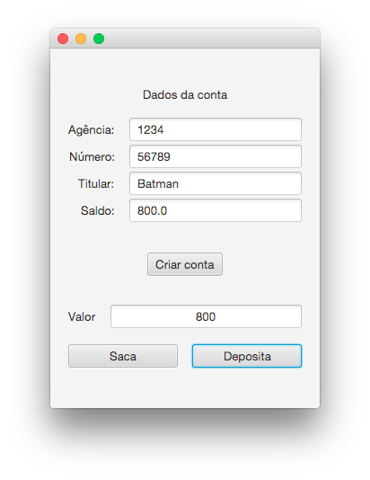

## Exercícios: Mostrando os dados da conta na tela
1. Crie a classe `ManipuladorDeContas` dentro do pacote `br.com.caelum.contas`. Repare
	que os pacotes `br.com.caelum.contas.main` e `br.com.caelum.contas.modelo` são
	subpacotes do pacote `br.com.caelum.contas`, portanto o pacote `br.com.caelum.contas`
	já existe. Para criar a classe neste pacote, basta selecioná-lo na janela de criação
	da classe:

	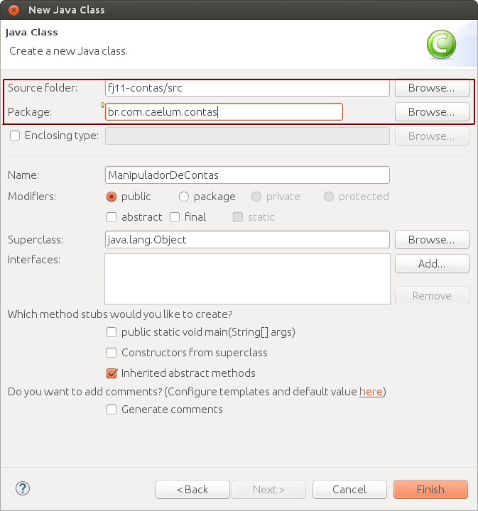

	A classe `ManipuladorDeContas` fará a ligação da `Conta` com a tela, por isso precisaremos
	declarar um atributo do tipo `Conta`.

	
1. Crie o método `criaConta` que recebe como parâmetro um objeto do tipo `Evento`.
	Instancie uma conta para o atributo `conta` e coloque os valores de `numero`,
	`agencia` e `titular`. Algo como:

	``` java
    public void criaConta(Evento evento){
        this.conta = new Conta();
        this.conta.setTitular("Batman");
        // faça o mesmo para os outros atributos
    }
	```
1. Com a conta instanciada, agora podemos implementar as funcionalidades de saque e
	depósito. Crie o método `deposita` que recebe um `Evento`, que é a classe que
	retorna os dados da tela nos tipos que precisamos. Por exemplo, se quisermos o
	valor a depositar sabemos que ele é do tipo `double` e que o nome do campo na
	tela é `valor` então podemos fazer:

	``` java
    public void deposita(Evento evento){
        double valorDigitado = evento.getDouble("valor");
        this.conta.deposita(valorDigitado);
    }
	```
1. Crie agora o método `saca`. Ele também deve receber um `Evento` nos mesmos
	moldes do `deposita`.

	
1. Precisamos agora testar nossa aplicação, crie a classe `TestaContas` dentro do
	pacote `br.com.caelum.contas` com um `main`. Nela vamos chamar o `main` da
	classe `TelaDeContas` que mostrará a tela de nosso sistema. Não se esqueça de
	fazer o import desta classe!

	``` java
    import br.com.caelum.javafx.api.main.TelaDeContas;

    public class TestaContas {

        public static void main(String[] args) {
            TelaDeContas.main(args);
        }
    }
	```

	Rode a aplicação, crie a conta e tente fazer as operações de saque e depósito. Tudo
	deve funcionar normalmente.
