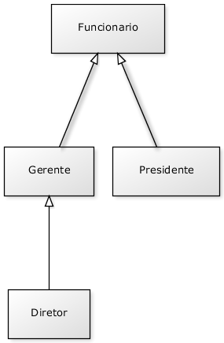
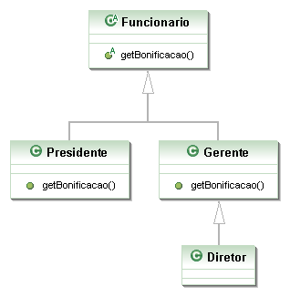
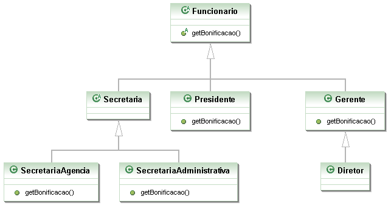

# Classes Abstratas
_"Dá-se importância aos antepassados quando já não temos nenhum."
-- François Chateaubriand_

Ao final deste capítulo, você será capaz de utilizar classes abstratas quando necessário.

<!--@note

* Muito simples, o difícil é os alunos entenderem quando usá-las.
* Lembre-os de que eles vão ver isso em __java.io__ com a __InputStream__.
* Após o lanche, seja curso noturno, seja integral.
* Uma boa analogia a ser feita é o clássico caso de Pessoa, Pessoa Física
e Pessoa Jurídica.
* Herdar um método abstrato é herdar a responsabilidade de ter o método.


Passe o exercício e dê o prazo de término até o final do período, ou seja: se for um curso
noturno, até o final da aula, se não, até o almoço. Leia o exercício com
eles e peça que respeitem o enunciado para não terem problemas.
-->

## Repetindo mais código?
<!--@note

* Escrever a classe Controle de Bonificações ao lado. Lembrar que o método
recebe. Ter como argumento qualquer funcionário.
* Convencer os alunos de que precisamos ter a referência a funcionário.
* Convencer os alunos de que **não** precisamos ter um objeto funcionário.
Boas perguntas a serem feitas são: "qual o salário de um funcionário?" e
"o que faz um funcionário?".

-->

Recordemos como pode estar nossa classe `Funcionario`:

``` java
	public class Funcionario {
	
		protected String nome;
		protected String cpf;
		protected double salario;
	
		public double getBonificacao() {
			return this.salario * 1.2;
		}
	
		// outros métodos aqui
	
	}
```

Considere o nosso `ControleDeBonificacao`:

``` java
	public class ControleDeBonificacoes {

		private double totalDeBonificacoes = 0;

			public void registra(Funcionario f) {
				System.out.println("Adicionando bonificação do funcionario: " + f);
				this.totalDeBonificacoes += f.getBonificacao();
			}

			public double getTotalDeBonificacoes() {
				return this.totalDeBonificacoes;
			}
	}
```

Nosso método `registra` recebe qualquer referência do tipo `Funcionario`, isto é, podem ser
objetos do tipo `Funcionario` e quaisquer de seus subtipos: `Gerente`, `Diretor` e,
consequentemente, alguma nova subclasse que venha a ser escrita sem prévio conhecimento do autor da
`ControleDeBonificacao`.

Estamos utilizando aqui a classe `Funcionario` para o polimorfismo. Se não fosse ela, teríamos um
grande prejuízo: precisaríamos criar um método `registra` com o objetivo de receber cada um dos tipos de
`Funcionario`, um para `Gerente`, um para `Diretor`, etc. Repare que perder esse poder é muito
pior do que a pequena vantagem a qual a herança apresenta ao herdar código.

Porém, em alguns sistemas, como é o nosso caso, usamos uma classe com apenas esses intuitos:
economizar um pouco código e ganhar polimorfismo para criar métodos mais genéricos que se encaixem
em diversos objetos.

Faz sentido ter uma referência do tipo `Funcionario`? Essa pergunta é diferente de saber se faz sentido
ter um objeto do tipo `Funcionario`: neste caso, faz, sim, e é muito útil.

Referenciando `Funcionario`, temos o polimorfismo de referência, já que podemos receber qualquer
objeto que seja um `Funcionario`. Porém, dar `new` em `Funcionario` pode não fazer sentido,
isto é, não queremos receber um objeto do tipo `Funcionario`, mas, sim, que aquela referência seja
ou um `Gerente`, ou um `Diretor`, etc. Algo mais **concreto** que um `Funcionario`.

``` java
	ControleDeBonificacoes cdb = new ControleDeBonificacoes();
	Funcionario f = new Funcionario();
	cdb.adiciona(f); // faz sentido?
```

Vejamos um outro caso em que não faz sentido ter um objeto daquele tipo, apesar da classe existir:
imagine a classe `Pessoa` e duas filhas, `PessoaFisica` e `PessoaJuridica`. Quando puxamos um
relatório de nossos clientes (uma array de `Pessoa`, por exemplo), queremos que cada um deles seja
ou uma `PessoaFisica` ou uma `PessoaJuridica`. A classe `Pessoa`, nesse caso, estaria sendo
usada apenas para ganhar o polimorfismo e herdar algumas coisas: não faz sentido permitir
instanciá-la.

Para resolver esses problemas, temos as classes abstratas.

## Classe abstrata

O que exatamente vem a ser a nossa classe `Funcionario`? Nossa empresa tem apenas `Diretores`,
`Gerentes`, `Secretárias`, etc. Ela é uma classe que apenas idealiza um tipo, define somente um
rascunho.

Para o nosso sistema, é inadmissível um objeto ser apenas do tipo `Funcionario` (pode existir
um sistema em que faça sentido ter objetos do tipo `Funcionario` ou apenas `Pessoa`, mas, no
nosso caso, não).


Utilizamos a palavra-chave `abstract` para impedir que ela possa ser instanciada. Esse é o efeito
direto de se usar o modificador `abstract` na declaração de uma classe:

``` java
	public abstract class Funcionario {
	
		protected double salario;
	
		public double getBonificacao() {
			return this.salario * 1.2;
		}
	
		// outros atributos e métodos comuns a todos Funcionarios
	
	}
```

E no meio de um código:

``` java
Funcionario f = new Funcionario(); // não compila!!!
```


O código acima não compila. O problema é instanciar a classe – criar referência você pode. Se ela
não pode ser instanciada, para que serve? Serve para o polimorfismo e herança dos atributos e
métodos, que são recursos muito poderosos, como já vimos.

Então, herdemos essa classe reescrevendo o método `getBonificacao`:

``` java
	public class Gerente extends Funcionario {
	
		public double getBonificacao() {
			return this.salario * 1.4 + 1000;
		}
	}

```



Mas qual é a real vantagem de uma classe abstrata? Poderíamos ter feito isso com uma herança comum.
Por enquanto, a única diferença é que não podemos instanciar um objeto do tipo `Funcionario`, que
já é de grande valia, dando mais consistência ao sistema.

Fique claro que a nossa decisão de transformar `Funcionario` em uma classe abstrata dependeu do
nosso domínio. Pode ser que, em um sistema com classes similares, faça sentido uma classe análoga a
`Funcionario` ser concreta.

## Métodos abstratos
Se o método `getBonificacao` não fosse reescrito, ele seria herdado da classe mãe, fazendo com que
devolvesse o salário mais 20%.

Levando em consideração que cada funcionário em nosso sistema tem uma regra totalmente diferente
a fim de ser bonificado, faz algum sentido ter esse método na classe `Funcionario`? Será que existe
uma bonificação padrão para todo tipo de `Funcionario`? Parece que não, cada classe filha terá um
método diferente de bonificação, pois, de acordo com nosso sistema, não existe uma regra geral:
queremos que cada pessoa a qual escreve a classe de um `Funcionario` diferente (subclasses de
`Funcionario`) reescreva o método `getBonificacao` de acordo com as suas regras.

<!--@note
Aqui também é interessante remover da lousa o método getBonificacao de funcionário e perguntar
se isso resolve o problema. Eles já devem perceber que vão perder polimorfismo, pois não poderão
invocar o método por meio de uma simples referência a funcionário.
-->

Poderíamos, então, jogar fora esse método da classe `Funcionario`? O problema é que, se ele não
existisse, não poderíamos chamar o método apenas com uma referência a um `Funcionario`, pois
ninguém garante que essa referência aponta para um objeto o qual tem esse método. Será que, dessa maneira,
devemos retornar um código como um número negativo? Isso não resolve o problema: se esquecermos de
reescrever esse método, teremos dados errados sendo utilizados como bônus.


Em Java, existe um recurso no qual, em uma classe abstrata, podemos escrever que determinado método será
**sempre** escrito pelas classes filhas. Isto é, um **método abstrato**.

Ele indica que todas as classes filhas (concretas, ou seja, não abstratas) devem reescrever
esse método, ou não compilarão. É como se você herdasse a responsabilidade de ter aquele método.

> **Como declarar um método abstrato**
>
> Às vezes, não fica claro como declarar um método abstrato.
>
> Basta escrever a palavra-chave `abstract` na sua assinatura e colocar um ponto e vírgula em
> vez de abrir e fechar chaves!

<!-- Comentário para separar quotes adjacentes. -->

``` java
	public abstract class Funcionario {
	
		public abstract double getBonificacao();
	
		// outros atributos e métodos
	
	}
```

Repare que não colocamos o corpo do método e usamos a palavra-chave `abstract` para defini-lo.
Por que não colocar corpo algum? Porque esse método nunca será chamado. Sempre que alguém
chamar o método `getBonificacao`, cairá em uma das suas filhas a qual realmente escreveu o
método.

Qualquer classe que estender a classe `Funcionario` será obrigada a reescrever esse método,
tornando-o concreto. Se não o reescreverem, um erro de compilação ocorrerá.

O método do `ControleDeBonificacao` estava assim:

``` java
	public void registra(Funcionario f) {
		System.out.println("Adicionando bonificação do funcionario: " + f);
		this.totalDeBonificacoes += f.getBonificacao();		
	}
```

Como posso acessar o método `getBonificacao` se ele não existe na classe `Funcionario`?

Já que o método é abstrato, **com certeza** suas subclasses têm esse método, garantindo que essa
invocação de método não falhará. Basta pensar: uma referência do tipo `Funcionario` nunca
aponta para um objeto que não tem o método `getBonificacao`, pois não é possível instanciar uma
classe abstrata, apenas as concretas. Um método abstrato obriga a classe na qual ele se encontra a ser
abstrata, assegurando a compilação coerente do código acima.

## Aumentando o exemplo
E se, no nosso exemplo de empresa, tivéssemos o próximo diagrama de classes com os seguintes métodos:



Ou seja, tenho a classe abstrata `Funcionario` com o método abstrato `getBonificacao`; as
classes `Gerente` e `Presidente` estendem `Funcionario` e implementam o método
`getBonificacao`; e, por fim, a classe `Diretor`, que estende `Gerente`, mas não implementa o
método `getBonificacao`.

Essas classes compilarão? Rodarão?

A resposta é sim. E, além de tudo, farão exatamente o que nós queremos, pois quando `Gerente` e
`Presidente` têm os métodos perfeitamente implementados, a classe `Diretor`, a qual não os tem, usará a implementação herdada de `Gerente`.



E esse diagrama em que incluímos uma classe abstrata `Secretaria` sem o método
`getBonificacao`, a qual é estendida por mais duas classes (`SecretariaAdministrativa`,
`SecretariaAgencia`) que, por sua vez, implementam o método `getBonificacao`, compilará? Rodará?


De novo, a resposta é sim, pois `Secretaria` é uma classe abstrata. Por isso, o Java tem certeza
de que ninguém conseguirá instanciá-la e tampouco chamar o seu método `getBonificacao`.
Lembrando que, nesse caso, não precisamos nem ao menos escrever o método abstrato `getBonificacao`
na classe `Secretaria`.

Se eu não reescrever um método abstrato da minha classe mãe, o código não compilará. Mas posso, em
vez disso, declarar a classe como abstrata!

> **java.io**
>
> Classes abstratas não têm nenhum segredo de aprendizado, mas quem está aprendendo orientação a
> objetos pode ter uma enorme dificuldade para saber quando utilizá-las, o que é muito normal.
>
> Estudaremos o pacote java.io, que usa bastantes classes abstratas, sendo um exemplo real de uso desse recurso (classe InputStream e suas filhas) e, assim, melhorando o seu entendimento.

<!-- Comentário para separar quotes adjacentes. -->


## Para saber mais...

* Uma classe que estende uma classe normal também pode ser abstrata. Ela não poderá ser instanciada,
mas sua classe pai, sim!

* Uma classe abstrata não precisa necessariamente ter um método abstrato.


## Exercícios: classes abstratas
1. Repare que a nossa classe `Conta` é uma excelente candidata para uma classe
	abstrata. Por quê? Que métodos seriam interessantes candidatos a serem abstratos?

	Transforme a classe `Conta` em abstrata:

	``` java
		public abstract class Conta {
			// ...
		}
	```
1. Como a classe `Conta` agora é abstrata, não conseguimos dar `new` nela mais.
	Se não podemos dar `new` em `Conta`, qual é a utilidade de ter um método
	que recebe uma referência à `Conta` como argumento? Aliás, posso ter isso?

	<!--@answer
	Esse código é possível, sim, e muito útil! Um método que receba uma `Conta`
	como argumento poderá trabalhar com qualquer objeto que **seja uma** Conta.
	Isto é, a classe `Conta` serve como um agrupador de tipos, e o polimorfismo
	ainda é possível!
	-->
1. Para entender melhor o `abstract`, comente o método `getTipo()` da
	`ContaPoupanca`. Dessa forma, ele herdará o método diretamente de `Conta`.

	Transforme o método `getTipo()` da classe `Conta` em abstrato. Repare que,
	ao colocar a palavra-chave `abstract` ao lado do método, o Eclipse rapidamente
	recomendará a remoção do corpo (body) do método com um quickfix.

	Sua classe `Conta` deve ficar parecida com:

	``` java
		public abstract class Conta {
			// atributos e métodos que já existiam

			public abstract String getTipo();
		}
	```

	Qual é o problema com a classe `ContaPoupanca`?

	<!--@answer
	Tornar um método abstrato é como dar uma responsabilidade a todas as
	filhas dessa classe: é obrigação de cada uma delas oferecer uma implementação
	ao método declarado na mãe.

	Veja pelo lado do compilador: se ele recebe um objeto que é uma `Conta`,
	ele sabe que esse objeto consegue _recuperar o tipo_. Como a `ContaPoupanca`
	**é uma** `Conta`, o compilador precisa que ela seja capaz de rodar o
	`getTipo` para ter certeza de que ela funcionará.
	-->
1. Descomente o método `getTipo` na classe `ContaPoupanca` e, se necessário, altere-o
	para que a classe possa compilar normalmente.
1. (Opcional) Existe outra maneira de a classe `ContaPoupanca` compilar se
	você não reescrever o método abstrato?

	<!--@answer
	Se transformarmos a classe `ContaPoupanca` em abstrata, ela volta a
	compilar, visto que a responsabilidade de implementar o método é repassada para
	seus filhos.
	-->
1. (Opcional) Para que ter o método `getTipo` na classe `Conta` se ele não
	faz nada? O que acontece se simplesmente apagarmos esse método da classe
	`Conta` e deixarmos o método `getTipo` nas filhas?

	<!--@answer
	O sentido de termos um método abstrato é fazer com que o compilador se
	certifique de que haverá uma implementação daquele método para toda `Conta`.

	Se tirarmos o `getTipo` da `Conta`, perdemos a garantia de que **todo**
	objeto que **é uma** conta terá implementado esse método. Isto é, uma
	classe que trabalhe com uma `Conta` não compilará mais a chamada ao método
	`getTipo`. Veja o exemplo abaixo:

	``` java
		public class ManipuladorDeContas {
        public void saca(Evento evento) {
            double valor = evento.getDouble("valorOperacao");
            if (conta.getTipo().equals("Conta Corrente")){
                conta.saca(valor - 0.10);
            } else {
                conta.saca(valor);
            }
        }
    }
	```
	-->
1. (Opcional) Posso chamar um método abstrato de dentro de um outro método da
	própria classe abstrata?
	Por exemplo, imagine que exista o seguinte método na classe `Conta`:

	``` java
  public String recuperaDadosParaImpressao() {
      String dados = "Titular: " + this.titular;
      dados += "\nNúmero: " + this.numero;
      dados += "\nAgência: " + this.agencia;
      dados += "\nSaldo: R$" + this.saldo;
      return dados;
  }
	```
	Poderíamos invocar o `getTipo` dentro desse método? Algo como:

	``` java
      dados += "\nTipo: " + this.getTipo();
	```

	<!--@answer
	Sim, poderia! Lembre-se de que o método é chamado no objeto, e não no tipo da
	referência. Assim, por mais que você chame uma `ContaCorrente` de
	`Conta`, ele continuará tendo a implementação do método
	`getTipo` que a classe `ContaCorrente` declarar.
	-->


<!--@note
Às vezes, para alguma turma mais avançada, eu dou uma viajada maior na explicação
do opcional de invocar um método abstrato dentro de outro método na classe.

Pergunto a eles se o sistema deles tem relatório e o que todo relatório
tem em comum: cabeçalho, corpo e rodapé. E daí questiono se é comum ter um relatório
com os mesmos dados, só mudando a formatação.

Aí falo que quero fazer relatórios para o nosso banco. Os cabeçalhos são iguais, o que
muda é o corpo: em um, eu só exibo o nome, em outro, o nome e o saldo.

Em seguida, vou emergindo deles as classes:
abstract class Relatorio {
void abstract cabecalho(), corpo(), rodape();
public void gera() {
cabecalho(); corpo(); rodape();
}
}

e class RelatorioSimples extends Relatorio {}, class RelatorioCompleto extends Relatorio{}

E então peço para eles o fazerem. Isso leva em torno de 1h30 e é um excelente desafio
para as sextas-feiras, dias em que sobra um tempo depois da aula de Eclipse. No fim,
diga que isso é o tal do Template Method.

Caso você dê esse exercício, quando chegar na parte da java io e tiver o Template Method
do método read(), será uma boa hora para conferir se eles fixaram o conhecimento.
-->
