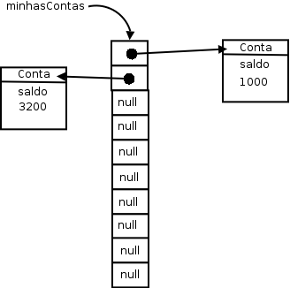
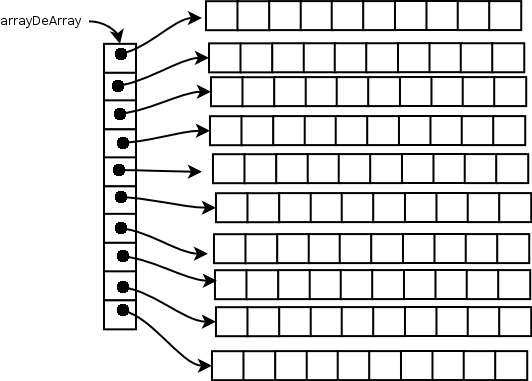
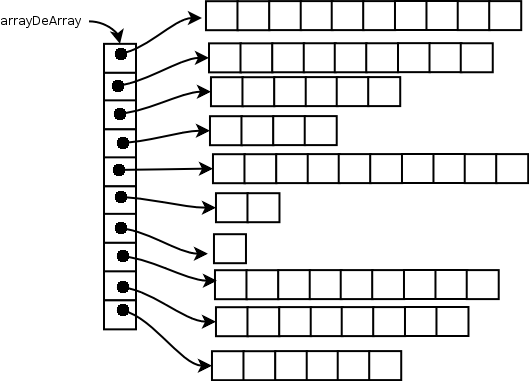

# Um Pouco de Arrays

_"O homem esquecerá antes a morte do pai que a perda da propriedade."--Maquiavel_

Ao final deste capítulo, você será capaz de:

* Declarar e instanciar arrays;
* Popular e percorrer arrays.


## O problema
Dentro de um bloco, podemos declarar diversas variáveis e usá-las:

``` java
double saldoDaConta1 = conta1.getSaldo();
double saldoDaConta2 = conta2.getSaldo();
double saldoDaConta3 = conta3.getSaldo();
double saldoDaConta4 = conta4.getSaldo();
```

Isso pode se tornar um problema quando precisamos mudar a quantidade de variáveis a serem declaradas
de acordo com um parâmetro. Esse parâmetro pode variar, por exemplo, a quantidade de número contidos
num bilhete de loteria. Um jogo simples tem seis números, mas podemos comprar um bilhete mais caro, com sete
números ou mais.


Para facilitar esse tipo de caso, podemos declarar um **vetor (array)** de `double`:

``` java
double[] saldosDasContas;
```

O `double[]` é um tipo. Uma array é sempre um objeto, portanto a variável
`saldosDasContas` é uma referência.
Precisamos criar um objeto para poder usar a array. Como criamos o objeto-array?

``` java
saldosDasContas= new double[10];
```

O que fizemos foi criar uma array de double de dez posições e atribuir o endereço no qual ela
foi criada. Podemos ainda acessar as posições da array:

``` java
saldosDasContas[5] = conta5.getSaldo();
```

O código acima altera a sexta posição da array. No Java, os índices da array vão de 0 a n-1, em que
n é o tamanho dado no momento no qual você criou a array. Se você tentar acessar uma posição fora
desse alcance, um erro ocorrerá durante a execução.


> **Arrays – Um problema no aprendizado de muitas linguagens**
>
> Aprender a usar arrays pode ser um problema em qualquer linguagem, porque envolve uma série de
> conceitos, sintaxe e outros. No Java, muitas vezes, utilizamos outros recursos em vez de arrays, em
> especial os pacotes de coleções do Java, que veremos no capítulo 15. Portanto, fique tranquilo caso
> não consiga digerir toda sintaxe das arrays em um primeiro momento.


No caso do bilhete de loteria, podemos utilizar o mesmo recurso. Além disso, a quantidade de números
do nosso bilhete pode ser definida por uma variável. Considerando que `n` indique quantos números nosso
bilhete terá, poderemos, então, fazer:

``` java
int[] numerosDoBilhete = new int[n];
```

E podemos, assim, acessar e modificar os inteiros com índice de `0` a `n-1`.

## Arrays de referências


É comum ouvirmos "array de objetos". Porém, quando criamos uma array de alguma classe, ela tem
referências. O objeto, como sempre, está na memória principal, e, na sua array, só ficam guardadas as
**referências** (endereços).

``` java
ContaCorrente[] minhasContas;
minhasContas = new ContaCorrente[10];
```

Quantas contas foram criadas aqui? Na verdade, **nenhuma**. Foram criados dez espaços que você pode
utilizar para guardar uma referência a uma ContaCorrente. Por enquanto, eles se referenciam a lugar
nenhum (`null`). Se você tentar:

``` java
System.out.println(minhasContas[0].getSaldo());
```

Um erro durante a execução ocorrerá! Pois, na primeira posição da array, não há uma referência a
uma conta nem a lugar nenhum. Você deve **popular** sua array antes.

``` java
ContaCorrente contaNova = new ContaCorrente();
contaNova.deposita(1000.0);
minhasContas[0] = contaNova;
```

Ou você pode fazer isso diretamente:

``` java
minhasContas[1] = new ContaCorrente();
minhasContas[1].deposita(3200.0);
```



Uma array de tipos primitivos guarda valores, uma array de objetos guarda referências.

Mas e se agora quisermos guardar tanto **Conta-Corrente** quanto **Conta Poupança**? Uma
array de **Conta-Corrente** só consegue guardar objetos do mesmo tipo. Se quisermos
guardar os dois tipos de conta, devemos criar uma array de **Conta**!

``` java
Conta[] minhasContas = new Conta[10];
minhasContas[0] = new ContaCorrente();
minhasContas[1] = new ContaPoupanca();
```

Perceba que não estamos criando um objeto do tipo `Conta`, que é abstrato, mas sim
dez espaços os quais guardam referências a qualquer tipo de conta.

## Percorrendo uma array

Percorrer uma array é muito simples quando fomos nós que a criamos:

``` java
public static void main(String[] args) {
	int[] idades = new int[10];
	for (int i = 0; i < 10; i++) {
		idades[i] = i * 10;
	}
	for (int i = 0; i < 10; i++) {
		System.out.println(idades[i]);
	}
}
```

 

Porém, em muitos casos, recebemos uma array como argumento em um método:

``` java
public void imprimeArray(int[] array) {
	// não compila!!
	for (int i = 0; i < ????; i++) {
		System.out.println(array[i]);
	}
}
```

Até aonde o `for` deve ir? Toda array, em Java, tem um atributo que se chama `length`, e você pode
acessá-lo para saber o tamanho da array à qual você está se referenciando naquele momento:

``` java
public void imprimeArray(int[] array) {
	for (int i = 0; i < array.length; i++) {
		System.out.println(array[i]);
	}
}
```

> **Arrays não podem mudar de tamanho**
>
> A partir do momento que uma array foi criada, ela **não pode** mudar de tamanho.
>
> Se você precisar de mais espaço, será necessário criar uma nova array e, antes de se referir a ela,
> copie os elementos da array velha.


## Percorrendo uma array no Java 5.0

O Java 5.0 apresenta uma nova sintaxe para percorrermos arrays (e coleções, que veremos mais à frente).

Caso você não tenha necessidade de manter uma variável com o índice que mostra a posição do
elemento no vetor (que é uma grande parte dos casos), podemos usar o **enhanced-for**.

``` java
public class AlgumaClasse{
	public static void main(String[] args) {
		int[] idades = new int[10];
		for (int i = 0; i < 10; i++) {
			idades[i] = i * 10;
		}
		
		// imprimindo toda a array
		for (int x : idades) {
			System.out.println(x);
		}
	}
}
```

 

Não precisamos mais do `length` para percorrer matrizes cujo tamanho não conhecemos:

``` java
public class AlgumaClasse {
	public void imprimeArray(int[] array) {
		for (int x : array) {
			System.out.println(x);
		}
	}
}
```

Isso também é válido para arrays de referências. Esse `for` nada mais é que um truque de compilação
para facilitar essa tarefa de percorrer arrays e torná-la mais legível.

## Exercícios: arrays

Com o objetivo de consolidarmos os conceitos sobre arrays, faremos alguns exercícios que não interferem em nosso projeto.

1. Crie uma classe `TestaArrays` e, no método `main`, uma array de contas de tamanho dez. Em seguida, faça um laço para criar dez contas com saldos distintos e colocá-las na array. Por exemplo, você pode utilizar o índice do laço e multiplicá-lo por 100 a fim de gerar o saldo de cada conta:

  ``` java
    Conta[] contas = new Conta[10];

    for (int i = 0; i < contas.length; i++) {
      Conta conta = new ContaCorrente();
      conta.deposita(i * 100.0);
      // Escreva o código para guardar a conta na posição i da array.
    }
  ```

  
1. Ainda na classe `TestaArrays`, faça um outro laço para calcular e imprimir a média dos saldos de todas as contas da array.
  
  
1. (Opcional) Crie uma classe `TestaSplit` que reescreva uma frase com as palavras na ordem invertida. _"Socorram-me, subi no ônibus em Marrocos"_ deve retornar _"Marrocos em ônibus no subi Socorram-me,"_. Utilize o método `split` da
  `String` para auxiliá-lo. Esse método divide uma `String` de acordo com o separador especificado e devolve as partes em uma array de `String`, por exemplo:

  ``` java
    String frase = "Uma mensagem qualquer";
    String[] palavras = frase.split(" ");

    // Agora só basta percorrer a array na ordem inversa imprimindo as palavras.
  ```

  
1. (Opcional) Crie uma classe `Banco` dentro do pacote `br.com.caelum.contas.modelo`.
	O `Banco` deve ter obrigatoriamente um nome, um
  número e uma referência a uma
	array de `Conta` de tamanho dez, e opcionalmente
  outros atributos que você julgar necessário.

	``` java
  public class Banco {
      private String nome;
      private int numero;
      private Conta[] contas;

      // Outros atributos que você achar necessário.

      public Banco(String nome, int numero) {
          this.nome = nome;
          this.numero = numero;
          this.contas = new ContaCorrente[10];
      }

      // Getters para nome e número. Não colocar os setters, pois já recebemos no
      // construtor.
  }
	```
1. (Opcional) A classe `Banco` deve ter um método `adiciona`, que recebe uma referência a
	`Conta` como argumento e guarda essa conta.

	Você deve inserir a `Conta` em uma posição da array que esteja livre.
	Existem várias maneiras para você fazer isso: guardar um contador a fim de indicar
	qual a próxima posição vazia ou procurar por uma posição vazia toda vez. O que
	seria mais interessante?

	Se quiser verificar qual a primeira posição vazia (nula) e adicionar nela, poderia
	ser feito algo como:

	``` java
  public void adiciona(Conta c) {
      for(int i = 0; i < this.contas.length; i++){
          // verificar se a posição está vazia
          // adicionar na array
      }
  }
	```

	É importante reparar que o método `adiciona` não
  recebe `titular`, `agencia`, `saldo`, etc. Essa
	não seria uma maneira estruturada nem orientada a
  objetos de se trabalhar. Você primeiro cria uma
  `Conta` e preenche com `titular`, `saldo`, etc. para
  então passar a referência dela.

	
1. (Opcional) Crie uma classe `TestaBanco` que terá um método `main`. Dentro dele, crie
	algumas instâncias de `Conta` e passe para o banco pelo método
	`adiciona`.
	``` java
  Banco banco = new Banco("CaelumBank", 999);
  //	 ....
	```

	Crie algumas contas e passe-as como argumento para o `adiciona` do banco:

	``` java
  ContaCorrente c1 = new ContaCorrente();
  c1.setTitular("Batman");
  c1.setNumero(1);
  c1.setAgencia(1000);
  c1.deposita(100000);
  banco.adiciona(c1);

  ContaPoupanca c2 = new ContaPoupanca();
  c2.setTitular("Coringa");
  c2.setNumero(2);
  c2.setAgencia(1000);
  c2.deposita(890000);
  banco.adiciona(c2);
	```

	Você pode criar essas contas dentro de um loop e dar
  a cada uma delas valores diferentes de depósitos:

	``` java
  for (int i = 0; i < 5; i++) {
      ContaCorrente conta = new ContaCorrente();
      conta.setTitular("Titular " + i);
      conta.setNumero(i);
      conta.setAgencia(1000);
      conta.deposita(i * 1000);
      banco.adiciona(conta);
  }
	```

	Repare que temos de instanciar `ContaCorrente` dentro do laço. Se a instanciação
	de `ContaCorrente` ficasse acima do laço, estaríamos adicionado cinco vezes a
	**mesma** instância de `ContaCorrente` nesse `Banco` e apenas mudando seu
	depósito a cada iteração, que, nesse caso, não é o efeito desejado.

	Opcional: o método `adiciona` pode gerar uma mensagem de erro indicando quando
	a array já está cheia.

	
1. (Opcional) Percorra o atributo `contas` da sua instância de `Banco` e imprima os
	dados de todas as suas contas. Para fazer isso, você pode criar um método
	chamado `mostraContas` dentro da classe `Banco`:

	``` java
  public void mostraContas() {
      for (int i = 0; i < this.contas.length; i++) {
          System.out.println("Conta na posição " + i);
          // preencher para mostrar outras informacoes da conta
      }
  }
	```

	Cuidado ao preencher esse método: alguns índices da sua array podem não conter
	referência a uma `Conta` construída, isto é, podem ainda se referir a
	`null`. Se preferir, use o `for` novo do Java 5.0.

	Então, depois de adicionar algumas contas, basta fazer isso por meio do seu `main`:

	``` java
	banco.mostraContas();
	```

	
1. (Opcional) Em vez de mostrar apenas o salário de cada funcionário, você pode
	usar o método `toString()` de cada `Conta` da sua array.
	
1. (Opcional) Crie um método para verificar se uma determinada `Conta` se
	encontra ou não como conta desse banco:

	``` java
  public boolean contem(Conta conta) {
      // ...
  }
	```

	Você precisará fazer um `for` em sua array e verificar se a conta
	passada como argumento se encontra dentro da array. Evite, ao máximo, usar números
	hard-coded, assim sendo, use o `.length`.
	
1. (Opcional) Caso a array já esteja cheia no momento de adicionar uma outra conta, crie uma array
	nova com uma capacidade maior e copie os valores da atual. Ou seja, você fará
	a realocação dos elementos da array, posto que o Java não tem isso: uma array nasce e morre
	com o mesmo length.

	> **Usando o this para passar argumento**
	>
	> Dentro de um método, você pode usar a palavra `this` para referenciar a si
	> mesmo e passar essa referência como argumento.

	

	


## Um pouco mais...

* Arrays podem ter mais de uma dimensão. Isto é, em vez de termos uma array de
dez contas, podemos ter uma array de dez por dez contas, e você pode acessar a conta
na posição da coluna x e linha y. Na verdade, uma array bidimensional em Java é
uma array de arrays. Pesquise sobre isso.



* Uma array bidimensional não precisa ser retangular, isto é, cada linha pode ter um número
diferente de colunas. Como? Por quê?



* O que acontece se criarmos uma array de 0 elementos? e -1?

* O método `main` recebe uma **array de Strings** como argumento. Essa array é passada pelo usuário
quando ele invoca o programa:

```$ java Teste argumento1 outro maisoutro```

E nossa classe:

``` java
public class Teste {
	public static void main (String[] args) {
		for(String argumento: args) {
			System.out.println(argumento);
		}
	}
}
```

Isso imprimirá:
```
argumento1
outro
maisoutro
```


## Desafios opcionais
1. Nos primeiros capítulos, você deve ter reparado que a versão recursiva para o
	problema de Fibonacci é lenta, porque toda hora estamos recalculando valores.
	Faça com que a versão recursiva seja tão boa quanto a versão iterativa
	(dica: use arrays para isso).

	
1. O objetivo deste exercício é fixar os conceitos vistos. Se você está com
	dificuldade em alguma parte desse capítulo, aproveite e treine tudo o que vimos
	até agora no pequeno programa abaixo:

	* Programa:

	Classe: Casa
	Atributos: cor, totalDePortas, portas[]
	Métodos: void pinta(String s),
	int quantasPortasEstaoAbertas(),
	void adicionaPorta(Porta p),
	int totalDePortas()

	Crie uma casa e pinte-a. Crie três portas, coloque-as na casa por intermédio do método
	`adicionaPorta`, abra-as e feche-as como desejar. Utilize o método
	`quantasPortasEstaoAbertas` para imprimir o número de portas abertas e o método
	`totalDePortas` para imprimir o total de portas em sua casa.
