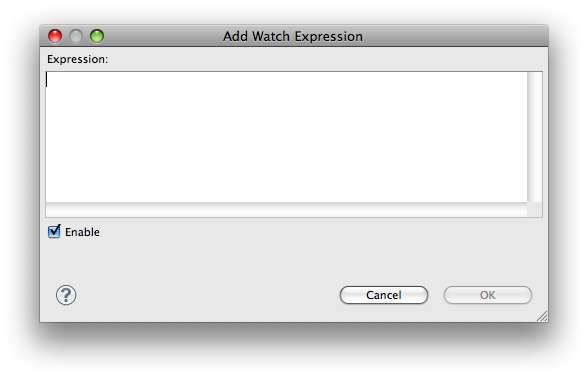
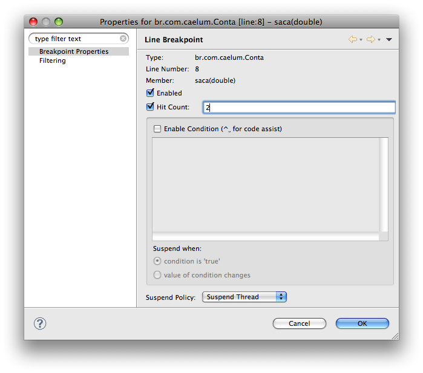
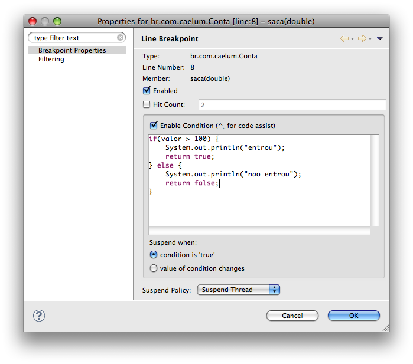
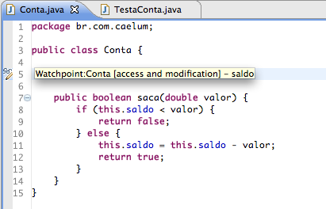
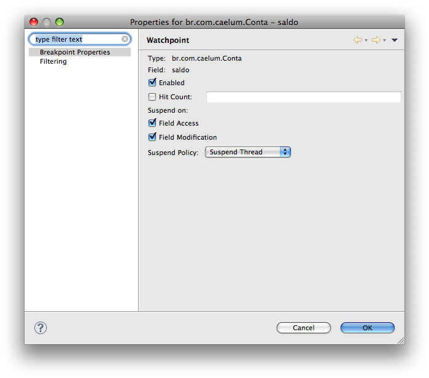
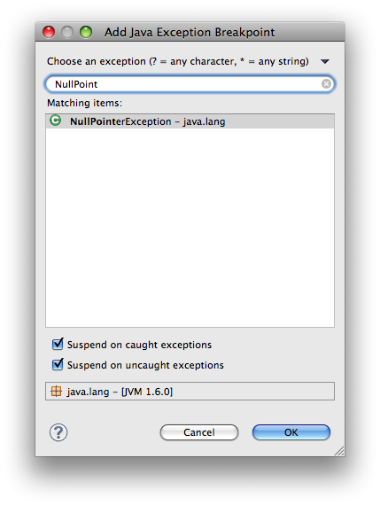
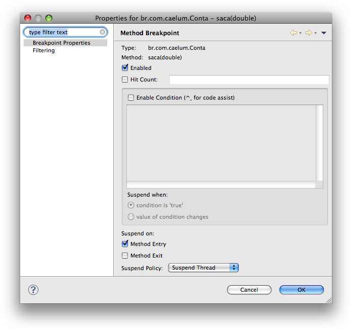
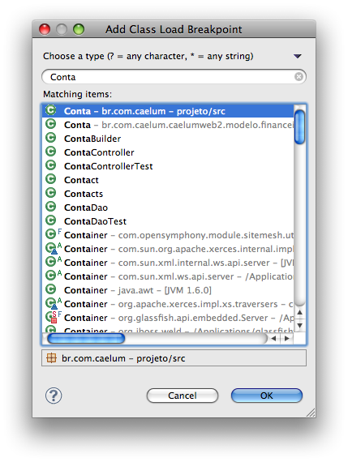
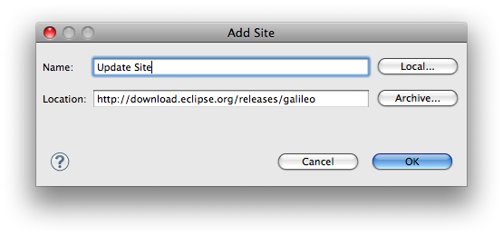

# Apêndice - Debugging
_"Olho por olho, e o mundo acabará cego."--Mohandas Gandhi_

## O que é debugar
Debugging (em português, depuração ou depurar) é um processo que tem por objetivo reduzir ou encontrar bugs no seu sistema.
De uma forma geral, debugging não é uma tarefa fácil de ser executada. Muitas variações podem atrapalhar
esse procedimento, como a linguagem que estamos utilizando e as ferramentas disponíveis para fazermos
debugging de um código.

O Java em si facilita muito esse processo, pois nos fornece maneiras de sabermos se o código está errado,
por exemplo, as exceptions. Em linguagens de baixo nível, saber em qual lugar o bug estava era extremamente complicado.
O que também facilita nosso trabalho são as ferramentas de debug. Veremos que elas são necessárias nos casos
nos quais nossos testes de unidade de logging não foram suficientes para encontrar a razão de um problema.

## Debugando no Eclipse
No curso, utilizamos o Eclipse como IDE para desenvolvermos nosso código. Como foi dito, ferramentas de
debugging facilitam muito nosso trabalho. O Eclipse é uma das IDEs mais poderosas do mercado e nos fornece
uma ferramenta que torna o processo extremamente simples.


O primeiro recurso o qual temos que conhecer quando começamos a debugar no Eclipse são os **breakpoints**. Eles
são pontos de partida em nosso código para iniciarmos o processo de debug. Por exemplo, no código abaixo, imagine
que desejamos debugar o comportamento do método `saca` da classe `Conta`, mais especificamente do `if`,
o qual verifica se saldo é menor que o valor a ser sacado. Colocaríamos o **breakpoint** exatamente na linha
`if (this.saldo < valor) {`:

``` java
public class Conta {
	
	private double saldo;

	public boolean saca(double valor) {
		if (this.saldo < valor) {
			return false;
		} else {
			this.saldo = this.saldo - valor;
			return true;
		}
	}
}
```

Mas como faço isso? Muito simples, basta clicar na linha que deseja adicionar o breakpoint e depois clicar
no menu **Run -> Toogle Breakpoint**.


Esse é o tipo mais clássico de breakpoint. Veremos alguns outros ao longo do capítulo.


 Já adicionamos o breakpoint que é o ponto de partida, agora iremos debugar nosso código. Precisamos
rodá-lo, ou seja, chamar o método `saca` para que o breakpoint seja encontrado. Teremos um
código similar ao seguinte:

``` java
public class TestaConta {
	public static void main(String[] args) {
		Conta conta = new Conta();
		conta.saca(200);
	}
}
```

O processo normal para executarmos esse código seria clicar no menu _Run -> Run As -> Java Application_. Porém,
para rodar o nosso código em **modo debug** e ativar nosso breakpoint, devemos rodar o código no menu
_Run -> Debug As -> Java Application_. Quando um breakpoint for encontrado no código que está sendo executado,
o Eclipse exibirá uma perspectiva específica de debug, apontando para a linha que tem o breakpoint.


## Perspectiva de debug
Temos várias informações disponíveis nessa perspectiva, algumas são essenciais e básicas para trabalharmos
com debug no nosso dia a dia, outras, não tão relevantes, e só as usamos em casos muito específicos.


Dentro da perspectiva de debug, temos uma aba chamada `Variables`. São exibidas todas as variáveis encontradas
dentro do código o qual você está debugando. Por exemplo, no debug que fizemos, serão exibidas as variáveis do método
`saca`, neste caso, `valor`, além dos atributos de instância do objeto.


Podemos exibir mais informações sobre as variáveis, basta adicionarmos as colunas que desejamos à tabela exibida.


É possível também adicionarmos constantes e variáveis estáticas da classe que está sendo debugada.


Na aba `Breakpoints`, são exibidos todos os breakpoints que seu workspace tem. Mas por que isso é importante?
É importante porque podemos ver todos os pontos de debug presentes e, melhor, podemos desabilitá-los um a um ou todos
de uma só vez. Você pode até mesmo pedir para exportar os breakpoints.

Para desabilitar ou habilitar todos breakpoints, é só clicar no ícone **Skip All Breakpoints**. Se quisermos desabilitar
cada um, basta desmarcar o checkbox, e o breakpoint será desativado.
Às vezes, encontrar o código em que o breakpoint foi colocado pode ser complicado. Na aba `Breakpoints`, isso fica bem
fácil de fazer, basta dar um duplo clique no breakpoint, e o Eclipse automaticamente nos mostra a classe dona dele.


Quando estamos debugando código, muitas vezes, é interessante saber o valor de alguma expressão ou método. Por exemplo,
uma condição dentro de um if, `this.saldo > valor`. Esse valor não está em uma variável, ele está em uma expressão,
o que pode tornar o seu valor complicado. A feature de `Expressions` descomplica esse processo para nós.
Na perspectiva de debug, temos a aba `Expressions`. Basta clicar com o botão direito dentro da aba e depois em **Add Expression**:



E o resultado da expressão é exibido.


Temos outra aba importante chamada de `Debug`. Dentre as suas funções, estão:


* **Threads** - Exibe as Threads que estão sendo executadas e, melhor, mostra qual Thread efetuou a chamada
para o método no qual está o debug. Além disso, mostra a pilha de execução, o que nos permite voltar à chamada de um método.
* **Barra de navegação** - Permite alterar os caminhos que o debug seguirá.


A lista a seguir mostrar algumas teclas e botões que alteram o caminho natural dos nosss debug:


* **F5** - Vai para o próximo passo do seu programa. Se for um método, ele entrará no código associado;
* **F6** - Também vai para o próximo passo, porém se for um método, ele não entrará no código associado;
* **F7** - Voltará e mostrará o método o qual fez a chamada ao código que está sendo debugado. No nosso caso, voltará ao método `main` da classe `TestaConta`;
* **F8** - Vai para o próximo breakpoint, se nenhum for encontrado, o programa seguirá seu fluxo de execução normal.


Você também pode usar os botões que estão presentes na aba `Debug`.


## Debug avançado

Depois que colocamos um breakpoint em algum ponto do nosso código, podemos colocar algumas propriedades nele, por exemplo,
usar alguma condição para restringir quando o breakpoint será ativado em tempo de execução. Podemos restringi-lo na propriedade **Hit Count**, e
o breakpoint só será ativado quando a linha em que ele se encontra for executada X vezes.



Como na imagem acima, o breakpoint só será ativado quando a linha de código em que ele se encontra for executada duas vezes.
Podemos também colocar alguma expressão condicional, um `if`, por exemplo.



O breakpoint, neste caso, somente será ativado quando o argumento `valor`, passado ao método `saca`, for maior
que 100. O importante aqui é notarmos que devemos retornar **sempre** um valor booleano, se não o fizermos, teremos um
erro em tempo de execução. Essa propriedade é válida quando queremos colocar aqueles famosos
`System.out.println("entrou no if tal")` para efeito de log. Podemos fazer isso colocando o log dentro da expressão
condicional nas propriedades do breakpoint.


O display é uma das partes mais interessantes do debug do Eclipse. Ele provê maneiras de executar qualquer
código que quisermos quando estamos em debugging: criar uma classe, instanciar objetos dessa classe, utilizar if's,
for's, while's, todos os recursos do Java, além de poder utilizar as variáveis, métodos e constantes da classe que
estamos debugando.

Um exemplo clássico é quando estamos em debugging e queremos saber o retorno de algum método ao qual não temos acesso,
o que faríamos antes seria colocar um amontoado de `System.out.println`, poluindo extremamente nosso código. No display,
o que fazemos é efetuar a chamada desse código, e automaticamente os resultados são exibidos.

Para ver um efeito real disso, alteraremos um pouco o comportamento da classe Conta, de modo que agora o saldo para
saque tenha que ser o saldo real mais o valor do limite. Nosso código fica assim:

``` java
public class Conta {
	
	private double saldoReal;
	private double limite;
	
	public Conta(double limite) {
		this.limite = limite;
	}

	public boolean saca(double valor) {
		if (!isSaldoSuficiente(valor)) {
			return false;
		} else {
			this.saldoReal = this.saldoReal - valor;
			return true;
		}
	}
	
	private boolean isSaldoSuficiente(double valor) {
		return (this.saldoReal + this.limite) > valor;
	}
}
```

Veja: o `if` que verifica se o saldo é suficiente para efetuarmos o saque chama um
método `isSaldoSuficiente`, podendo ser um problema quando estamos debugando, afinal a
condição do `if` é um método. Se utilizarmos o display, podemos fazer a chamada do método
`isSaldoSuficiente`, ver seu resultado e, o melhor, não afetamos o debug, apenas queremos ver o
resultado do método, por exemplo.

Para exibir a aba **Display**, é bem simples. Tecle **Ctrl + 3**, digite **Display**, e a aba será
exibida. Quando rodarmos nosso código em modo debug, poderemos ir no display, digitar uma chamada
para o método `isSaldoSuficiente`, executar esse código que foi digitado selecionando-o dentro
do display, teclar **Ctrl + Shift + D**, e o resultado será impresso, assim como na imagem abaixo:


Muitas vezes, queremos seguir alguma variável de instância, ou seja, queremos ser notificados sobre qualquer chamada para essa variável (leitura ou escrita) . Podemos usar o watchpoint, que fará nosso programa entrar em
modo debug, quando qualquer alteração na variável que estamos seguindo ocorrer; o programa entrará em debug
exatamente na linha em que a alteração foi feita. Para colocarmos um watchpoint, basta dar um duplo clique no atributo
de instância no qual desejamos inseri-lo.



É possível alterar esse comportamento padrão e definir se você quer que o watchpoint seja ativado para leitura
ou somente escrita.




A ideia desse tipo de breakpoint é fazer nosso programa entrar em debug quando alguma exceção específica ocorrer.
Quando definirmos essa exceção no **Exception Breakpoint** e ela ocorrer, automaticamente nosso programa entra
em debug na linha em que gerou aquela exceção.
Por exemplo, alteremos o codigo da classe `TestaConta` para que tenha uma `NullPointerException`:

``` java
public class TestaConta {
	public static void main(String[] args) {
		Conta conta = null;
		conta.saca(10);
	}
}
```

Quando rodarmos o código acima, teremos uma `NullPointerException`. Pode ser útil, nesses casos, debugar
e saber o local onde a exceção está, de fato, ocorrendo, em qual linha mais especificamente. Para fazermos isso, podemos criar
um Exception Breakpoint, que debugará códigos que eventualmente lancem uma `NullPointerException`, por exemplo.
Basta abrirmos a aba **Breakpoints** e clicarmos no ícone abaixo:


Será aberta uma janela em que podemos buscar por uma exceção específica.




Podemos definir se um breakpoint é ativado antes ou depois que o método é chamado. Para o definirmos,
basta estar em qualquer parte do método que desejamos debugar e clicar no menu **Run -> Toogle Method Breakpoint**.
Podemos editar as propriedades desse breakpoint dizendo se queremos que ele seja ativado antes(default) ou depois
da execução do método. Basta acessar as propriedades do method breakpoint e alterá-las.




É útil quando desejamos que um breakpoint seja ativado no momento em que uma classe específica for carregada pela primeira vez, e
chamamos esse breakpoint de **Class Breakpoint**. Basta clicar no menu **Run -> Add Class Load Breakpoint**, e
uma janela será aberta. Assim, digitamos o nome da classe e adicionamos:



## Profiling
Um dos principais hábitos que nós, desenvolvedores, devemos evitar é a questão da otimização prematura, ou seja,
quando desenvolvemos uma aplicação para um cliente, temos de nos preocupar em **atender aos requisitos funcionais
de maneira mais rápida e mais simples possível**. O passo seguinte é refatorar seu código para que ele seja melhorado
e, no futuro, possa se adaptar às possíveis mudanças.

A regra é: "deixe os problemas do futuro para serem resolvidos no futuro".

Uma das ferramentas que nos auxilia na questão de não otimizar nosso código prematuramente é a
profiling; esta torna aparentes, por exemplo, os problemas de memória e CPU, os quais podem fazer com que otimizemos nosso
código. Atualmente, devido às técnicas que utilizamos para entregar algo de valor ao cliente, focamos principalmente
na qualidade, nos aspectos funcionais, nos testes, etc. Porém, muitos problemas que não fazem parte dos requisitos funcionais
podem acontecer apenas quando a aplicação está em produção. Nesse ponto, as ferramentas de profiling também nos ajudam.

## Profiling no Eclipse TPTP
Juntamente com o Eclipse, temos a opção de instalar e utilizar uma ferramenta de profiling conhecida como Eclipse TPTP
(Eclipse Test & Performance Tools Platform), que nos fornece opções com o objetivo de isolar e identificar problemas de performance,
tais como: memória (memory leak), recursos e processamento. O TPTP nos permite analisar de simples aplicações Java até
aplicações que rodam em múltiplas máquinas e plataformas.

> **Alternativas ao TPTP**
>
> Existem algumas alternativas ao TPTP, os mais conhecidos são Netbeans Profiler (http://profiler.netbeans.org/), que é gratuito,
> e o JProfiler (http://www.ej-technologies.com/products/jprofiler/overview.html), que é pago.

<!-- Comentário para separar quotes adjacentes. -->


O TPTP não vem, por padrão, junto com o Eclipse. Portanto, para o utilizarmos, é necessário a sua instalação. Podemos fazer
o processo de instalação de duas maneiras.
A primeira e mais fácil é utilizando o Update Site do Eclipse, que resolve as possíveis dependências e nos possibilita
escolher quais features queremos instalar. Para instalar o TPTP por meio desse recurso, basta ir no menu:
_Help -> Install New Software_; uma janela será aberta; basta clicar em Add... e preenchê-la, conforme a imagem a seguir:



É só adicionar as ferramentas do TPTP ao nosso Eclipse. Para isso, selecione o repositório que acabamos de
adicionar e a versão do TPTP que queremos instalar, neste caso, a versão 4.6.2.


> **Instalando pelo ZIP**
>
> Você tem a opção de instalar o TPTP baixando o ZIP do projeto e colocando manualmente no diretório de instalação do
> seu Eclipse.
> Mais informações no link: http://www.eclipse.org/tptp/home/downloads/4.6.0/documents/installguide/InstallGuide46.html

<!-- Comentário para separar quotes adjacentes. -->


Uma adversidade que pode acontecer em aplicações e muitas pessoas não a conhecem a fundo é a questão do pool de Strings,
o qual pode eventualmente ficar muito grande. Esse problema pode ser causado porque objetos do tipo String são imutáveis,
sendo assim, se fizermos concatenações de Strings muitas vezes, cada uma delas produzirá uma nova String,
que automaticamente será colocada no pool da JVM.

A alternativa, nesse caso, seria trabalhar com objetos do tipo StringBuilder ou StringBuffer, que funcionam como Strings,
mas não produzem Strings novas em caso de uma concatenação. Entretanto, como medir o tamanho do nosso pool de String?

O TPTP tem uma aba de estatísticas que nos mostra o tempo em que um método levou para ser executado, quanto processamento
esse método gastou e a quantidade de memória gasta com cada método. Analisemos algumas dessas estatísticas criando um
código o qual concatene várias Strings, de maneira que sobrecarregue o pool e gere bastante processamento e consumo de memória.
``` java
public class Teste {

	public static void main(String[] args) {
		for (int i = 0; i < 1000000; i++) {
			String x = "a" + i;
			System.out.println(x);
		}
	}

}
```

Para analisarmos o resultado do código, rodaremos o código do `main` por meio do menu
_Run -> Profile As -> Java Application_.
> **Versões**
>
> Infelizmente, o TPTP funciona somente no Windows. Versões destinadas ao MacOS e ao Linux são prometidas, mas,
> até hoje, estão em desenvolvimento. Uma alternativa paga para esses outros sistemas operacionais é o JProfiler.

<!-- Comentário para separar quotes adjacentes. -->
